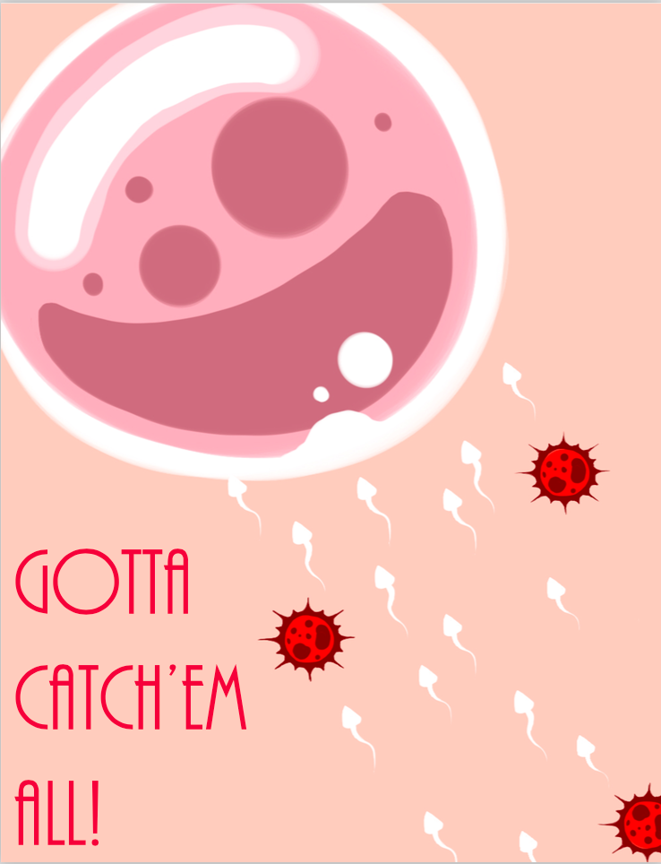
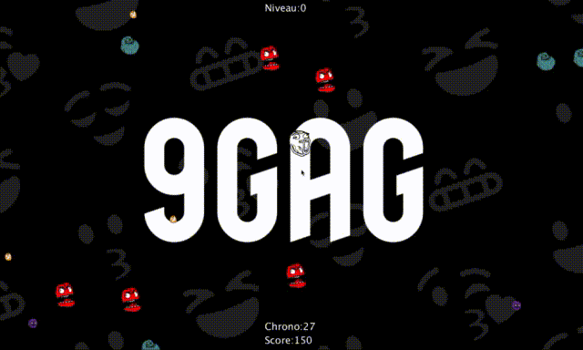
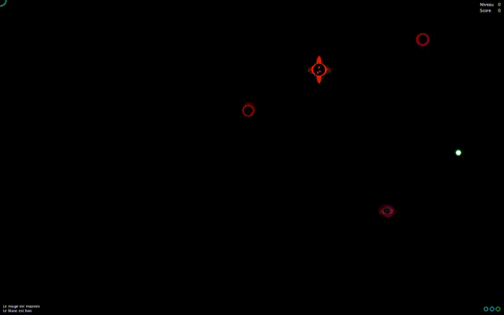
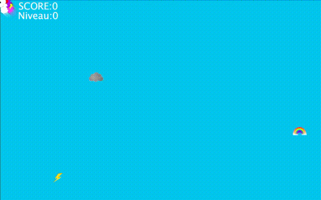
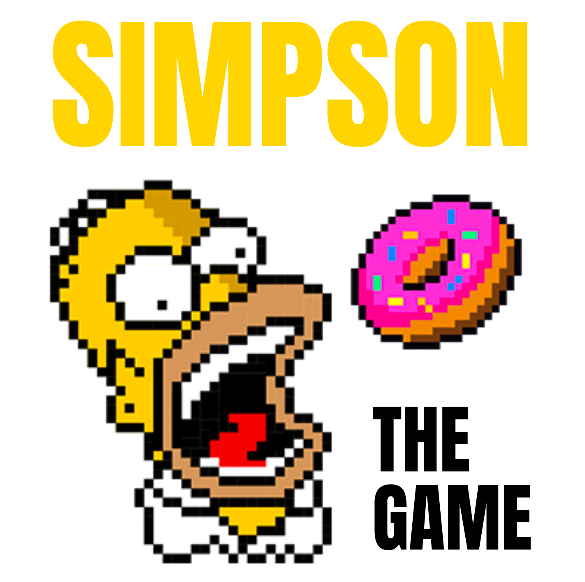
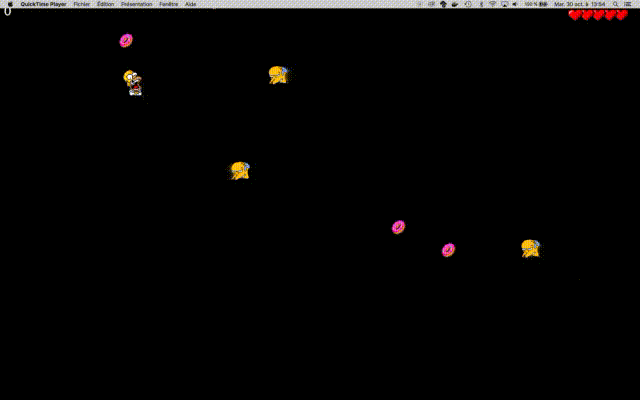
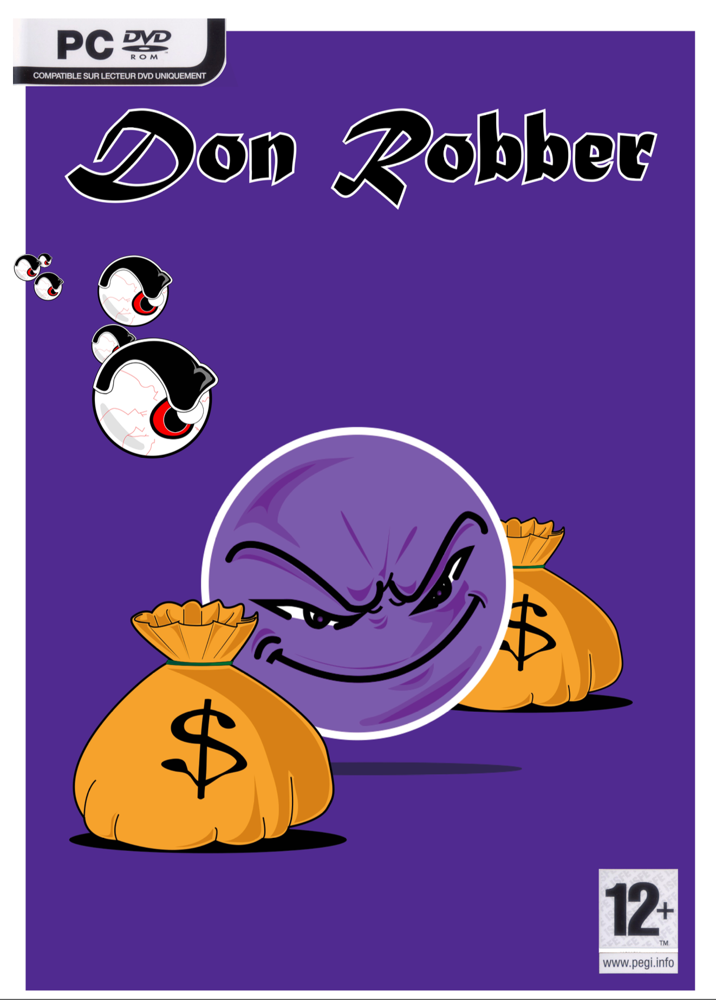
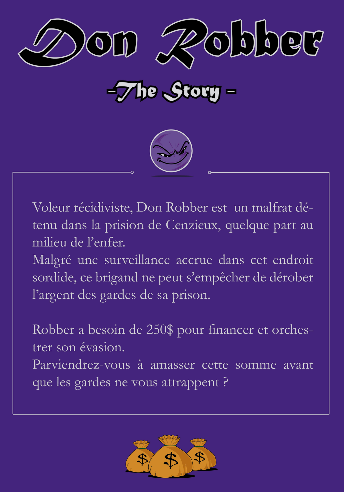
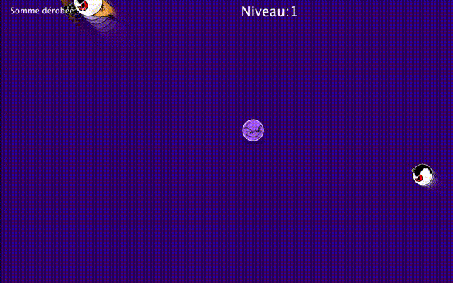
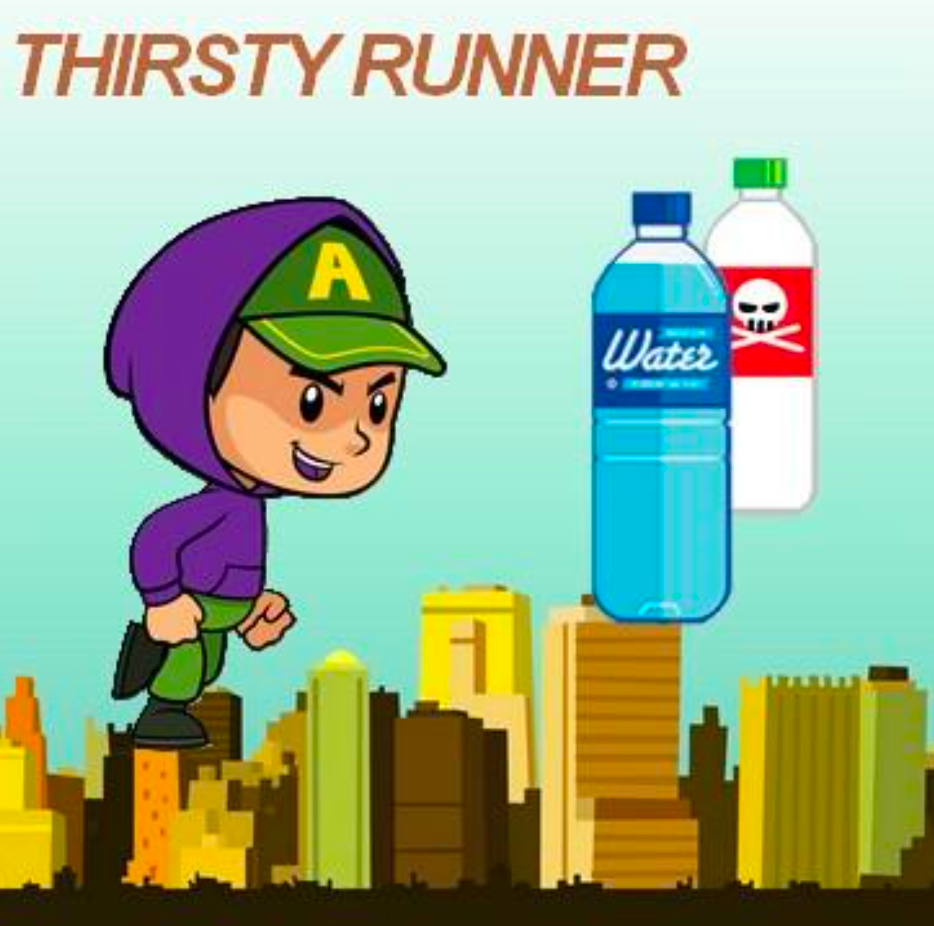

Code produced by students for the "back-to-school" workshop - first year in Game Design @lecolededesign.

To play those games you will need to download [processing](https://processing.org/) and install :
- the sound library
- the minimim library

You can then download or clone [this repo](https://github.com/AtelierNum/workshop_gamefromscratch_2018) and launch each game within the processing IDE.

Instructions available to students can be found [here](https://github.com/b2renger/processing_physics_game_workshop) (in french).

## Léo Archer
 

## Basile Bellanger
 

## Mathilde Belvèze
 

## Siloë Boiteau
 
 

## Hugo Boschat
 
 

## Axel Bossard
 

## Julie Boudaud
Bonjour, dans ce jeu vous allez devoir aider un petit Dino a survire.
C'est le dernier survivant de son espèce :( 
Sa famille est morte à cause des villaines météorites :'(
Attrapez de la nouriture pour le rendre plus fort :D
Faites attention a pas lui faire manger n'importe quoi !!

Je compte sur vous !

 

/!\ météorite = mouvement souris inversé 

## Johan Carrère
 

## Charles Fouyer
 
 

## Solenn  Jaunait

 
 

## Arthur Jolly
vous incarnez la planete terre, c'est a vous de la repeupler. collecter un maximum de Barack Obama et de vifs d'or pour créer un monnde meilleur et gagner mais... faites attention aux stormtroopers et 
aux fiats multipla !

 

## Elena Ky
Bien le bijour! tu aimes la petite sirène ? :D
Et bien tu seras un petit poisson :D
Attrapes les bulles d'eau et évite les bulles de tars :D
Atteins les 100 points et c'est gagné mais passe dans le négatif et c'est fini

 

## Tanguy Le Crom
This is a two player game !

 
 

## Rémi Leprévost
 
    
## Riwan Majidate

 
 

## Célia Toupin
 
 

